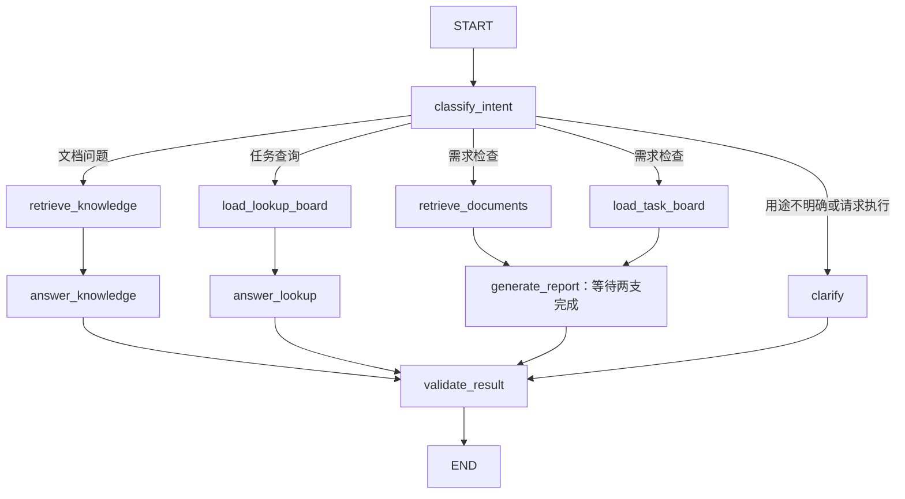

# 第 10 天：需求缺口检查与显式 LangGraph 流程

本文记录第 10 天的实现。第 11 天已增加 NDJSON 流、实际节点轨迹和断连取消，最新行为见 [流式输出说明](day11-streaming.md)。

## 对用户有什么用

需求写了“上传和删除文档”，看板却只有“实现上传”时，检查可以指出删除功能可能没有对应任务，并展示原文依据。文档没有明确删除时是否清理索引，则作为待确认问题提出。

结果分为“已有对应任务”“可能遗漏”“需要确认”。有任务表示已安排，不证明功能已经实现。没有明显缺口时允许空建议，不强行再拆一套任务。

项目详情新增“需求检查”入口。原有 AI 问答、任务规划入口和接口保留。这次没有数据库迁移、任务写入、审批、会话保存或流式输出。

## 使用方法与模式边界

1. 在知识库上传 `.md` / `.txt` 需求资料，等待索引就绪。
2. 打开“需求检查”，输入具体范围，例如“对照文档检查上传和删除功能是否都有对应任务”。
3. 可以自动识别用途，也可以手动选择需求检查、文档问答、已有任务查询。手动选择优先，不让模型覆盖。
4. 核对报告中的任务标题和状态、文档引用，以及“依据与检查范围”。如需调整任务，仍在看板手工处理。

没有就绪文档也可以查询任务。没有相关片段时，需求检查返回“资料不足”，不会把它说成“没有遗漏”。结果是本次临时结果，刷新、离开、清空或重新提交都会丢弃旧结果。

- `AI_MODE=mock`：真实读取文档和看板；简单规则演示意图分类，不调用聊天模型。需求检查只展示真实读取范围，不编造覆盖/遗漏结论。任务查询按待办、进行中、已完成及中文/英文双引号内的标题关键词筛选；未识别的筛选条件不代表已被执行，结果会明确说明规则。文档问答沿用原文摘录展示。
- `AI_MODE=live`：结构化模型判断意图和生成报告/查询结果，问答复用第 8 天的来源校验。沿用 `MODEL_NAME`、`LLM_API_KEY`、`LLM_BASE_URL`，没有增加密钥。输入、读取到的文档片段及任务内容会发送到配置的模型服务。
- `configured` 只验证配置非空，不验证供应商连接或能力。真实模型需支持工具形式的结构化输出。自动化测试使用离线模型，没有进行真实供应商效果验收。

## State、路由与并行读取



`WorkflowState` 保存本次输入、用途、片段、看板和结果。JWT 身份、项目 ID、读取器仅在服务端的冻结 `WorkflowContext` 中，不是模型或请求可填写的字段。

读取前建立项目、就绪文档和任务的共同基线；通过 `PlanningReadService.fork()` 得到独立读取器。两者共用相同基线，各自持有锁与数据库会话，文档检索不会阻塞看板读取。LangGraph 使用多起点的 `add_edge` 等待两支完成后生成报告。返回前重新核对基线，发现检查期间有项目、任务或就绪资料变化就返回 409。这不是数据库持久锁，结果返回后数据仍可能变化。

图没有写入节点、执行工具、Checkpoint 或稳定会话 ID。每次请求从 START 开始，不携带上轮状态。模型输出只是结构化分析数据，不负责调度数据库操作。

## 检查范围和验证

- 每次按输入检索最多 **4 个片段**，每段正文和标题最多 **400 字符**，仅包含当前项目的就绪文档。
- 可检索文档列表表示搜索范围，不表示每份都已读。`full_document_review` 固定为 `false`；不能据此宣称全部需求完整覆盖。
- 当前读取器支持 **100 项以内的完整看板**；超过时明确返回 422，不截取前 100 项后声称完整。此边界也适用于该入口的问答与查询，因为共同基线会检查任务变化。
- 任务标题、ID、状态和优先级原样读取；说明与验收标准分别最多 400 字符，带截断标记。报告返回实际读到的任务与片段，方便核对。
- 已有对应任务、可能遗漏、待确认问题均必须引用本次实际片段；对应任务 ID 只能来自本次完整看板。服务端拒绝假引用、外部任务 ID、重复引用和不完整的检查来源列表。
- 没有遗漏、没有匹配任务、资料不足都是允许的结果，不要求凑数。结果按文本展示，资料或模型中的 HTML 不会执行。
- 这些检查验证身份、结构、引用编号和数据一致性，不能证明每个语义判断准确，也不保证检索召回全部需求。需要用户结合原文确认。

每个服务实例同一时间处理一个本流程请求，等待名额最多 1 秒，整体限时 65 秒。自动分类至多调用一次模型，报告或任务筛选至多一次；模型 SDK 的网络 I/O 等待上限为 25 秒、不自动重试。持续收包不代表报告已经完成，业务总时限仍限制完整流程。问答生成沿用原 RAG 的 30 秒网络等待上限；普通 JSON 问答最多重试一次，流式问答不自动重试，均受总时限约束。检索与看板每支执行一次，没有循环或无限重试。

MiMo 官方 `mimo-v2.5` / `mimo-v2.5-pro` 的结构化调用显式设置 `thinking.type=disabled`，遵循 [官方工具调用建议](https://mimo.mi.com/docs/en-US/quick-start/faq/api-integration)。用途识别、报告生成、任务查询、普通/流式问答和任务规划共用 `model_compat.py`，避免不同入口漏配；其他模型或兼容接口不添加此参数。

模型网络超时会提示具体阶段，例如“需求报告生成超时”。安全日志记录代码定义的阶段、耗时和超时类别；流式边界补充请求编号，便于区分模型网络等待超时与 65 秒业务总时限。不记录用户输入、文档内容、模型原文或密钥。

2026-09-24 只读联调：相同项目、输入、4 个检索片段及 8 项任务，原配置在报告生成阶段触发 65 秒总时限；补齐 MiMo 配置后，一次完整复测约 43.45 秒返回报告，结构、引用、任务归属和读取一致性校验通过，`persisted=false`。另一次验证约 47.56 秒返回但被格式校验拒绝，该格式问题未再次复现；严格校验仍保留。这是少量样例验证，不代表每次都能成功或固定耗时。测试在独立进程运行，没有替换正在运行的服务或写入业务数据。

页面请求上限 75 秒。“取消等待”会取消前端等待并忽略迟到结果，不承诺已开始的向量线程或供应商计算立即停止。

## 接口与文件

- `GET /api/v1/projects/{project_id}/assistant`：模式、配置状态、就绪文档数、任务数。
- `POST /api/v1/projects/{project_id}/assistant/runs`：`{message, intent?}`，默认 `intent="auto"`。输入 1～2000 字符，拒绝身份、审批等额外字段。
- 结果包括 `intent`、`status`、`answer`、可选 `report`、任务、来源、读取范围和已完成读取记录，`persisted=false`。
- 401 未登录、403 非成员、404 无权访问项目、409 检查中数据变化、422 输入不合法或看板过大、502 模型/引用失败、503 配置缺失或繁忙、504 超时。

| 文件 | 职责 |
| --- | --- |
| `service/app/services/workflow_graph.py` | StateGraph、条件路由、并行汇合、结果与引用验证 |
| `service/app/services/workflow_service.py` | 权限、并发、超时、共同读取基线与安全错误 |
| `service/app/services/workflow_model_service.py` | 结构化分类/报告/查询、只读提示词和演示规则 |
| `service/app/services/planning_read_service.py` | 复用第 9 天读取边界，增加独立基线副本 |
| `service/app/schemas/workflow_*.py` | 输入和输出契约 |
| `service/app/api/v1/workflow_controller.py` | 成员接口与身份依赖 |
| `vue/src/components/RequirementCheck.vue` | 报告、原文、检查范围、取消与重试 |
| `vue/src/api/workflow_api.ts` | 请求、超时与取消信号 |
| `service/tests/test_workflow.py` | 真实 Graph、离线结构化模型、权限/只读/并行/变更测试 |
| `vue/tests/e2e/requirement_check.spec.ts` | 三类报告、空建议、演示/资料不足、取消、重试和手机布局 |

## 验证与部署

后端使用测试数据库与模拟索引，Graph 使用真实 LangGraph 实现；离线聊天模型验证结构化输出路径。并行用例让检索等待看板完成，以验证两者没有被一个锁串行化。SQL 监听断言本流程只发出 SELECT。浏览器用例拦截全部 API，拒绝未预期请求，不操作真实业务数据。

2026-09-16 本次验证：231 项后端测试、47 项前端单元测试、49 项生产包浏览器测试全部通过；生产构建与新增 Python 文件的 Ruff 检查通过。浏览器使用单 worker，检查了桌面和手机布局。真实供应商模型效果尚未验收，测试通过不代表语义判断一定正确。

Docker 前端占用 5174 时，可指定独立测试端口：

```bash
cd vue
DEVPILOT_E2E_PORT=5184 npm run test:e2e
DEVPILOT_E2E_PORT=5184 npm run test:e2e:preview
```

LangGraph 已作为直接依赖记录在 `pyproject.toml` 与 `uv.lock`，没有升级现有间接依赖版本。Jenkins 配置和部署凭据无需调整。本地完成的代码需另行提交、推送，再构建才会部署；当前开发验证不自动触发 Jenkins。

下一阶段再做第 11 天的流式输出与执行轨迹，第 12 天再做人工确认和幂等写入。

框架语义参考 [LangGraph Graph API](https://docs.langchain.com/oss/python/langgraph/graph-api) 与 [多起点 add_edge 的汇合行为](https://reference.langchain.com/python/langgraph/graph/state/StateGraph/add_edge)。
