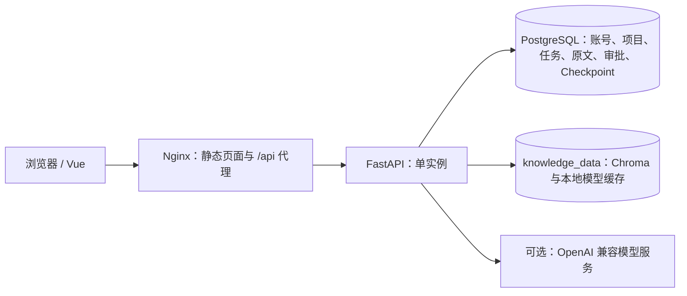

# 第 14 天：部署与演示交付

这一阶段交付可重复启动的 Docker Compose、演示数据初始化命令、项目说明和完整录屏脚本。前 13 天的业务功能不另起一套实现。

## 新环境从零启动

需要 Git、Python 3（仅生成配置，使用标准库）、Docker Engine/Desktop 与支持 `up --wait` 的 Docker Compose。后端、前端及数据库依赖都在容器中安装，无需在宿主机安装 uv 或 Node。

从仓库根目录执行：

```bash
python3 scripts/init_env.py
docker compose -f docker-compose.yml config --quiet
docker compose -f docker-compose.yml up -d --build --wait --wait-timeout 180
docker compose -f docker-compose.yml exec api python -m app.cli.seed_demo
```

配置工具创建权限为 600 的 `.env`，随机生成数据库密码与 JWT 密钥，默认使用 `AI_MODE=mock`。若 `.env` 已存在，会拒绝覆盖；已有部署不需要重新生成配置。初始化演示数据时，按提示分别设置成员和审批人密码，至少 8 位；密码不写入代码、日志或演示文档。

通用配置的访问地址：

- 前端：<http://localhost:5173>
- API 文档：<http://localhost:8000/docs>
- 经 Nginx 代理的健康检查：<http://localhost:5173/api/v1/health>

`-f docker-compose.yml` 用来明确使用仓库的通用配置。本机已有的 `docker-compose.override.yml` 属于机器特定配置，可能改用 5174 等端口。已有 Jenkins 部署继续使用原来的 `COMPOSE_FILE` 和凭据，不要照抄新环境命令去覆盖现有部署。

第一次构建需要下载基础镜像和依赖；第一次索引还要下载中文向量模型。API 健康不代表文档已完成索引，请在知识库等待“已就绪”。索引不在 API 启动路径中，避免首次下载阻塞所有页面。

## 演示数据

默认创建以下数据：

| 内容 | 初始值 |
| --- | --- |
| 成员 | `demo14_member`，角色 `member` |
| 审批人 | `demo14_reviewer`，角色 `reviewer` |
| 项目 | 餐厅外卖网站 · 演示 |
| 已有任务 1 | 实现顾客登录与会话保持，已完成，P2 |
| 已有任务 2 | 实现菜品列表与分类筛选，进行中，P2 |
| 文档 | [restaurant.md](../service/demo/restaurant.md)，进入真实后台索引队列 |

[project.json](../service/demo/project.json) 保存项目和任务样例。初始化使用与正常登录相同的密码哈希，以及正常文档上传的校验逻辑；不绕过认证、不直接伪造就绪向量、不自动批准方案。

账号、项目、任务和文档在一个事务中准备。再次执行并输入原密码，不会重复创建数据，也不会重置项目改名、任务内容或状态。现有同名账号的密码或角色不符时会报错并回滚，不能借此重置其他账号。文档索引失败仍需在知识库中点击“重试”。删除演示数据后再次运行命令，会补回缺失的初始资料。

可为另一套演示指定独立账号：

```bash
docker compose -f docker-compose.yml exec api python -m app.cli.seed_demo \
  --member another_demo_member --reviewer another_demo_reviewer
```

`--password-stdin` 仅用于自动化：标准输入两行依次为成员和审批人密码；不要把真实密码作为命令行参数或写入版本库。

## 配置真实模型

在 `.env` 中填写：

```dotenv
AI_MODE=live
MODEL_NAME=供应商提供的模型标识
LLM_API_KEY=自行填写
LLM_BASE_URL=供应商的OpenAI兼容接口地址
```

模型需支持 Chat Completions、工具调用及项目使用的结构化输出。随后一起重建 API 和 Web 容器，使 API 读取新配置，Nginx 重新解析 API 地址：

```bash
docker compose -f docker-compose.yml up -d --force-recreate --wait --wait-timeout 180 api web
```

使用 Jenkins 时，更新 `devpilot-env-file` Secret file 凭据后构建。只更换 API Key 不会自动更换模型名称和接口地址；这三项都以部署配置为准。

`mock` 能演示真实上传、索引、检索、审批、写入和持久化，但回答采用摘录/模板，需求检查不会声称已分析覆盖率。展示真实推理与回答逐字输出时必须使用 `live`，并明确告知录屏观众当前模式。真实模型质量验收按[第 8 天评估说明](day8-knowledge-qa.md)执行。

## 部署结构和持久化



- Compose 启动顺序为 PostgreSQL 健康 → API 迁移并启动 → Web 启动；`--wait` 等待健康状态，失败会返回非零状态。
- Web 的健康检查包含静态页和 `/api/v1/health` 代理；Nginx 关闭 API 响应缓冲，规划请求有 145 秒代理读取预算。
- API 容器启动自动执行 Alembic；应用启动时初始化 PostgreSQL Checkpointer。Checkpoint 直接使用 `DATABASE_URL`，不需要另填 `LANGGRAPH_DATABASE_URI`。
- `postgres_data` 保存业务数据、文档原文、会话与审批检查点；`knowledge_data` 保存 Chroma 和模型缓存。二者都使用命名卷。
- 重启或 `docker compose down` 保留命名卷；`down -v` 会删除数据，不用于日常更新。项目名决定卷名前缀，已有部署要保持相同的 Compose 项目名。
- 当前只支持单 API 实例。公共互联网部署还需 HTTPS、域名和网络访问控制，本项目的默认端口用于本机演示。

## 日常检查与故障定位

```bash
docker compose -f docker-compose.yml ps
curl --fail http://localhost:5173/api/v1/health
docker compose -f docker-compose.yml logs --tail=80 api web
```

| 现象 | 检查位置 |
| --- | --- |
| `python:3.12-slim` 元数据或 Docker Hub token 下载失败 | 镜像仓库网络；构建还没进入应用代码阶段。恢复 Docker 网络/代理后重试，不删除数据卷 |
| API 启动失败 | API 日志中的迁移、数据库连接；核对 `POSTGRES_*` 与 `DATABASE_URL` |
| 修改数据库密码后启动失败 | 已初始化的 PostgreSQL 卷不会因修改环境变量自动更改库内密码；应使用原配置或按数据库流程修改 |
| 文档索引失败 | 知识库错误提示与 API 日志；首次模型下载需要可用网络，恢复后点重试 |
| 页面显示旧代码 | 确认构建的分支/提交，重新构建 Web 镜像并更新容器 |
| 生成超时/中断 | 缩小目标范围；已保存的规划使用“继续生成并提交”，避免重复新建会话 |
| 审批显示待恢复执行 | 原审批人进入该状态，继续已保存的决定；重复执行不会重复创建任务 |

## 完整演示

照着[第十四天录屏脚本](day14-recording-script.md)操作，覆盖登录、创建项目、上传、问答、检查、规划、审批、任务列表与重启恢复。它是操作和讲解脚本，不是已经录制的视频。

## 本次验证结果（2026-09-22）

| 检查 | 结果 |
| --- | --- |
| 配置生成、随机密钥、拒绝覆盖与端口校验 | 2 项测试通过 |
| 演示数据重复执行、保留修改、账号冲突回滚 | 4 项测试通过，已包含在后端测试中 |
| Python 3.12 禁网测试镜像 | 281 项通过；需要外部 PostgreSQL 的 1 项专项用例按配置跳过 |
| API / 测试 / Web Docker 镜像 | 构建通过，Web 的既有单元测试与生产构建层命中缓存 |
| 空 PostgreSQL 数据卷、自动迁移与健康检查 | 三个服务全部健康 |
| 真实向量索引、Nginx 代理与 NDJSON | 中文模型索引、带引用问答、任务查询全部通过 |
| 持久规划、修改批准与重复决定 | 暂停、恢复、编辑入库及幂等验证通过 |
| API 重启、全部容器移除后重建 | 任务编号、审批结果和索引均保留 |
| Ruff、Git 空白、本地文档链接 | 通过 |

容器验收使用独立的随机 Compose 项目、账号、端口和数据卷；中文 Embedding 使用真实的 `BAAI/bge-small-zh-v1.5`，只复用了已经下载的公开模型缓存，未复制业务数据或原有 Chroma。聊天/规划采用 `AI_MODE=mock`，没有调用在线模型；本次结果不代表真实模型回答质量评估。

镜像构建首次访问 Docker Hub 超时，使用本机已有代理进行本次构建后成功，未修改全局代理配置。完整容器验收报告保存在本机 `test-results/day14-compose/report.json`。测试容器、专用数据卷和临时配置已清理，现有业务环境保持运行。
